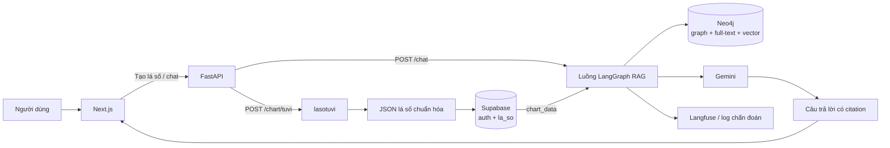
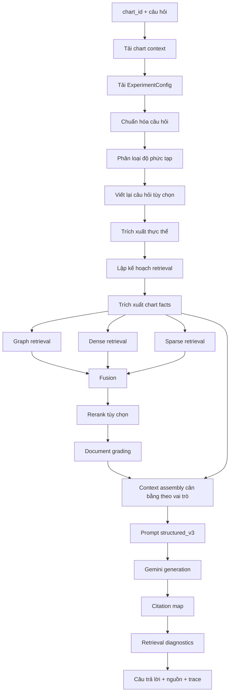
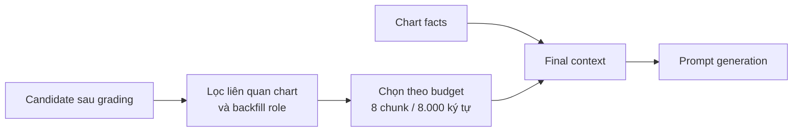

# Báo cáo hệ thống TuVi GraphRAG

> Cập nhật: 17/08/2026. Báo cáo này mô tả kiến trúc đang có trong mã nguồn và tổng hợp toàn bộ ablation study đã hoàn tất trên bộ `TuViQA v1`.

## 1. Mục tiêu và phạm vi

TuVi GraphRAG là hệ thống hỗ trợ luận giải Tử Vi có bám nguồn. Hệ thống thực hiện bốn việc chính:

1. Sinh lá số Tử Vi từ thông tin sinh.
2. Lưu lá số chuẩn hóa của người dùng.
3. Truy xuất tri thức Tử Vi từ kho tài liệu bằng nhiều đường truy xuất.
4. Sinh câu trả lời tiếng Việt có cá nhân hóa theo lá số, kèm citation cho dữ kiện lá số và nguồn tài liệu.

Hệ thống không coi mô hình sinh là nguồn tri thức độc lập. Dữ kiện trong lá số phải đi từ khối `[CHART]`; các quy tắc và luận giải phải đi từ các nguồn `[S1]`, `[S2]`, ... có trong context. Khi evidence không đủ, hệ thống được yêu cầu nêu rõ giới hạn thay vì suy diễn mạnh.

## 2. Thành phần kỹ thuật

| Thành phần | Vai trò |
|---|---|
| Next.js | Giao diện tạo lá số, xác thực và chat. |
| FastAPI | Cung cấp API tạo lá số, chat, kiểm tra sức khỏe và chẩn đoán. |
| `lasotuvi` | Sinh dữ liệu lá số Tử Vi chuẩn hóa. |
| Supabase | Xác thực, lưu người dùng và bảng `la_so` chứa `chart_data`. |
| Neo4j | Lưu corpus/chunk/entity/quan hệ; cung cấp graph retrieval, full-text retrieval và vector retrieval. |
| BAAI/bge-m3 | Sinh vector truy vấn cho dense retrieval; embedding có 1.024 chiều. |
| BAAI/bge-reranker-v2-m3 | Cross-encoder reranker cục bộ khi được bật. |
| LangGraph | Điều phối chuỗi xử lý RAG theo `RAGState`. |
| Gemini Flash Lite | Sinh câu trả lời và chấm đánh giá chính thức. |
| Langfuse | Ghi sự kiện chat/quan sát runtime khi cấu hình có sẵn. |

## 3. Kiến trúc tổng thể



### 3.1. Luồng tạo lá số

1. Giao diện gửi ngày sinh, giờ sinh, giới tính và nhãn lá số đến `POST /chart/tuvi`.
2. FastAPI gọi `lasotuvi` để sinh lá số.
3. Backend chuẩn hóa kết quả thành `chart_data` với `chart_system = TUVI` và `chart_version = tuvi-v1`.
4. Giao diện lưu lá số vào Supabase trong bảng `la_so`.
5. Khi chat, `chart_id` được dùng để tải lại `chart_data` phục vụ cá nhân hóa câu trả lời.

### 3.2. Luồng chat

Endpoint `POST /chat` nhận tối thiểu `chart_id` và `query`. Backend tải lá số từ Supabase, chạy đồ thị RAG và trả về:

```text
answer
sources
trace
retrieval_diagnostics
experiment_id
config_hash
chunk_strategy_id
generation_metadata
citation_metadata
```

Nếu retrieval hoặc generation bị lỗi tạm thời, endpoint chat có thể trả fallback có kiểm soát thay vì lỗi HTTP 500; trace và log sẽ lưu node nào fallback cùng nguyên nhân.

## 4. Đồ thị RAG và cách các khối nối với nhau

`LangGraph` sử dụng một chuỗi node tuyến tính. Khi môi trường không có `LangGraph`, mã có `SequentialDryRunGraph` chạy đúng thứ tự node để phục vụ kiểm thử/chẩn đoán.



### 4.1. Chuẩn hóa, viết lại và trích xuất thực thể

- **Chuẩn hóa câu hỏi:** loại khoảng trắng dư, giữ nội dung câu hỏi.
- **Phân loại độ phức tạp:** dùng nhãn benchmark `Direct`, `One-hop`, `Two-hop` nếu có; nếu không, dùng heuristic.
- **Viết lại câu hỏi:** chỉ chạy khi `query_rewrite_enabled = true`. Trong toàn bộ matrix retrieval đã đánh giá, giá trị này là `false`; do đó không có Gemini query expansion làm nhiễu so sánh retrieval.
- **Trích xuất thực thể:** dùng từ điển để nhận diện cung, sao, tổ hợp và thuật ngữ cần thiết cho graph retrieval, sparse retrieval và retrieval plan.
- **Lập kế hoạch retrieval:** suy ra evidence role cần thiết, ví dụ định nghĩa sao, phạm vi cung, quy tắc quan hệ hoặc tổ hợp. Các role này được dùng để sinh role query và bảo vệ evidence diversity ở bước context assembly.

### 4.2. Chart facts

`chart_fact_extraction` rút thông tin cần thiết trực tiếp từ `chart_data`: cung liên quan, chính tinh/phụ tinh, trạng thái, quan hệ như tam hợp và các facts khác phục vụ câu hỏi.

Chart facts được đưa vào context qua khối `[CHART]`. Đây là nguồn duy nhất cho khẳng định về lá số cá nhân; mô hình sinh không được tự thêm sao, cung, trạng thái miếu/hãm, Tuần/Triệt hoặc quan hệ không tồn tại trong `[CHART]`.

### 4.3. Ba đường retrieval

| Đường retrieval | Cách hoạt động | Điểm mạnh | Giới hạn |
|---|---|---|---|
| Graph | Tìm chunk qua Entity và quan hệ Neo4j như `MENTIONS`, `GIAI_THICH`, `RELATED_TO`, `THUOC_CUNG`, `DOI_CHIEU`. | Bảo toàn quan hệ cấu trúc giữa cung, sao và khái niệm. | Coverage thấp nếu kiến thức không có quan hệ/entity phù hợp. |
| Dense | Mã hóa câu hỏi bằng BGE-M3 rồi tìm vector gần nhất trong `chunkVectorBgeM3`. | Bắt tương đồng ngữ nghĩa, hữu ích khi cách diễn đạt query và corpus khác nhau. | Tốn thời gian/model tài nguyên; có thể đưa candidate tương tự ngữ nghĩa nhưng thiếu quan hệ cụ thể. |
| Sparse | Dùng full-text index `chunkFulltext`, kết hợp truy vấn thuật ngữ và thực thể chính xác. | Mạnh với tên sao, cung và thuật ngữ Tử Vi. | Dễ bỏ sót khi query/corpus không trùng từ vựng. |

Mỗi đường chỉ chạy khi được bật trong `ExperimentConfig` và được retrieval plan cho phép. Candidate có metadata về retrieval path, entity khớp, evidence role, nguồn và provenance.

### 4.4. Fusion, reranker và document grading

Sau retrieval, candidate được hợp nhất bằng một trong ba chiến lược:

| Phương pháp | Ý nghĩa |
|---|---|
| `rrf` | Reciprocal Rank Fusion; kết hợp thứ hạng của các đường retrieval, ổn định khi score giữa các đường không cùng thang đo. |
| `weighted_sum` | Tổng có trọng số theo đường Graph/Dense/Sparse. |
| `graph_first` | Ưu tiên candidate từ Graph trước, sau đó dùng score fusion và các tiêu chí phụ. |

Nếu reranker bật, BGE cross-encoder chấm lại query–chunk rồi giữ `top_k`. Sau đó `document_grading` dùng overlap, thực thể bắt buộc và evidence signal để loại candidate không phù hợp.

Điểm thiết kế quan trọng là thứ tự:

```text
retrieval → fusion → reranker → document grading → context assembly
```

Vì reranker chạy trước document grading, một `top_k` nhỏ có thể loại vĩnh viễn evidence đa dạng trước khi các bước sau có cơ hội chọn theo role.

### 4.5. Context assembly

Context assembly có nhiệm vụ biến candidate đã xếp hạng thành context cuối cùng cho Gemini.

Các quy tắc chính:

```text
Tối đa 8 chunk corpus
Tối đa 8.000 ký tự context
Mỗi excerpt tối đa 700 ký tự
Chart summary và chart facts được ưu tiên trước chunk corpus
```

Ngoài budget, hệ thống:

1. Ưu tiên candidate có liên quan đến sao/cung thực tế của lá số.
2. Loại candidate generic nhiễu khi đã có đủ candidate liên quan.
3. Backfill candidate còn thiếu evidence role bắt buộc.
4. Dùng `balanced` ordering để tránh context chỉ gồm một loại evidence.



### 4.6. Prompt và sinh câu trả lời

Prompt mặc định của các matrix mới là `tuvi_generation_structured_v3`. Prompt nhận hai input động:

```text
QUESTION = rewritten_query hoặc normalized_query
CONTEXT  = final_context
```

Prompt yêu cầu bốn phần nếu phù hợp:

1. Dữ kiện chính từ lá số, có citation `[CHART]`.
2. Luận giải tổng hợp từ nguồn, có citation `[Sx]` cho từng ý.
3. Thuận lợi và điểm cần lưu ý.
4. Kết luận ngắn, đồng thời nêu giới hạn dữ liệu.

`structured_v3` không tự thêm knowledge hoặc mở rộng evidence. Do đó, khi hai config giữ prompt cố định, khác biệt quality chủ yếu đến từ `final_context` được cung cấp bởi retrieval/ranking/context assembly.

### 4.7. Citation, diagnostics và khả năng truy vết

Sau generation, `citation_map` đối chiếu citation với context chunk và tạo danh sách nguồn trả về. `retrieval_diagnostics` lưu số candidate theo đường, số candidate fused/reranked/graded/context selected, độ phức tạp, question family và các retrieval path cuối cùng.

Các evaluation report còn lưu `config_hash`, dataset hash, manifest hash, evaluator hash, checkpoint và item-level result để có thể audit/reproduce.

## 5. Cấu hình runtime và cấu hình được khuyến nghị

### 5.1. Cấu hình runtime mặc định đang nằm trong mã nguồn

File `configs/default_production.yaml` hiện có các lựa chọn chính:

| Thành phần | Giá trị hiện tại |
|---|---|
| Chunking | `chunk_semantic_embedding_bge_m3` |
| Prompt | `tuvi_generation_structured_v3` |
| Generation model | `gemini-3.1-flash-lite-preview` |
| Query rewrite | Tắt |
| Graph retrieval | Bật |
| Dense retrieval | Tắt |
| Sparse retrieval | Bật |
| Fusion | `rrf` |
| Reranker | Bật, BGE reranker, `top_k=10` |
| Document grading | Bật |
| Context assembly | `balanced` |
| Cache | Tắt trong evaluation/runtime config này |

### 5.2. Cấu hình được evidence khuyến nghị cho production

Evidence hiện tại khuyến nghị candidate production sau, **nhưng candidate này chưa tự động thay thế `default_production.yaml`**:

| Thành phần | Candidate khuyến nghị |
|---|---|
| Chunking | `chunk_structure_parent_child` |
| Prompt | `tuvi_generation_structured_v3` |
| Generation model | `gemini-3.1-flash-lite-preview` |
| Graph retrieval | Bật |
| Dense retrieval | Tắt |
| Sparse retrieval | Bật |
| Fusion | `rrf` |
| Reranker | **Tắt** |
| Query rewrite | Tắt |
| Document grading | Bật |
| Context assembly | `balanced` |

Lý do không dùng ngay config runtime default là reranker `top_k=10` hiện tại có bằng chứng làm cắt evidence quá sớm. Candidate production cần được đặt trong file riêng, ví dụ `configs/eval_candidate_v3.yaml`, rồi chạy một confirmation run trước khi promotion thành default runtime.

## 6. Phương pháp đánh giá

### 6.1. Bộ dữ liệu và bộ chấm

Tất cả comparative matrix chính thức dùng:

```text
Dataset: benchmark/tuvi_golden_dataset/release/tuviqa_v1_release.jsonl
Số item: 100
Judge backend: gemini
Judge model: gemini-3.1-flash-lite-preview
```

Mỗi config chạy trên toàn bộ 100 item. Checkpoint item-level cho phép resume sau khi quota, mạng hoặc process bị gián đoạn mà không xóa kết quả đã có.

### 6.2. Metric

| Metric | Ý nghĩa |
|---|---|
| Faithfulness | Câu trả lời có bám context/evidence được cung cấp hay không. |
| Answer relevancy | Câu trả lời có trực tiếp và phù hợp với câu hỏi hay không. |
| Context recall | Context có đủ evidence cần thiết để trả lời, với item corpus-grounded. |
| Citation coverage | Mức độ câu trả lời có citation hợp lệ cho mệnh đề dùng nguồn. |
| Graph hit | Retrieval Graph có hit evidence khi áp dụng. |
| Retrieval p95 / RAG p95 | Độ trễ p95 retrieval và end-to-end. |

Trong báo cáo tổng hợp, `quality score` chỉ là heuristic mô tả để xếp hạng:

```text
0.35 × Context recall
+ 0.25 × Faithfulness
+ 0.20 × Answer relevancy
+ 0.15 × Citation coverage
+ 0.05 × Graph hit
```

Score này không thay thế từng metric và cố ý không trộn latency vào quality score. Độ trễ giữa các wave chạy ở khác thời điểm/máy cần được xem là tín hiệu định hướng, không phải benchmark phần cứng controlled tuyệt đối.

## 7. Ablation Study A — Matrix Chunking × Prompt 3×3

### 7.1. Thiết kế

Matrix gồm:

```text
3 chunking strategy × 3 prompt template × 100 item = 900 pairs
```

Chunking strategy:

```text
chunk_fixed_512
chunk_structure_parent_child
chunk_semantic_embedding_bge_m3
```

Prompt template:

```text
tuvi_generation_v1
tuvi_generation_grounded_v2
tuvi_generation_structured_v3
```

Retrieval được giữ cố định là Graph + Sparse + RRF trong study này. Do đó matrix cô lập tác động của cấu trúc chunk và prompt.

### 7.2. Kết quả chính

Top cell theo quality score:

| Hạng | Config | Chunking | Prompt | Faith | Relevancy | Context recall | Citation |
|---:|---|---|---|---:|---:|---:|---:|
| 1 | `parent_child_graph_sparse_rrf` | parent-child | structured_v3 | 0.900 | 0.799 | 0.714 | 0.989 |
| 2 | `fixed_512_graph_sparse_rrf` | fixed-512 | structured_v3 | 0.894 | 0.794 | **0.718** | 0.989 |
| 3 | `semantic_bge_m3_graph_sparse_rrf` | semantic BGE-M3 | structured_v3 | 0.889 | 0.779 | 0.699 | 0.989 |
| 4 | `semantic_bge_m3_prompt_v1_graph_sparse_rrf` | semantic BGE-M3 | v1 | 0.872 | 0.782 | 0.706 | 0.986 |

Kết luận:

1. **Best full cell:** `parent_child_graph_sparse_rrf`.
2. **Prompt tốt nhất theo marginal analysis:** `tuvi_generation_structured_v3`.
3. **Chunking tốt nhất theo marginal analysis:** `chunk_semantic_embedding_bge_m3`.
4. Hai kết luận chunking không mâu thuẫn: semantic BGE-M3 có trung bình biên tốt nhất qua prompt, nhưng parent-child kết hợp với structured_v3 là cell hoàn chỉnh tốt nhất.

### 7.3. Insight

- `structured_v3` giúp mô hình tổ chức câu trả lời theo chart facts, luận giải, cảnh báo và giới hạn evidence; lợi ích rõ nhất khi context có nhiều evidence role.
- Parent-child chunking tạo cell tốt nhất vì giữ liên hệ giữa đoạn con và cấu trúc tài liệu, hỗ trợ luận giải có điều kiện.
- Semantic BGE-M3 vẫn là baseline chunking mạnh về mặt trung bình và là lựa chọn dễ dùng cho retrieval dense/vector.

## 8. Ablation Study B — Matrix Retrieval/Fusion/Reranker v2, `top_k=10`

### 8.1. Thiết kế

```text
10 config × 100 item = 1.000 pairs
```

Các biến được cô lập:

- đường retrieval: Graph, Dense, Sparse và tổ hợp;
- fusion: `rrf`, `weighted_sum`, `graph_first`;
- reranker: bật/tắt;
- reranker bật trong matrix v2 dùng `top_k=10`.

### 8.2. Kết quả nổi bật

| Config | Faith | Relevancy | Context recall | Citation | Retrieval p95 |
|---|---:|---:|---:|---:|---:|
| `graph_dense_rrf` | 0.912 | **0.837** | **0.7593** | 0.989 | 67.8s |
| `baseline_no_reranker` | **0.915** | 0.828 | 0.7440 | 0.989 | **6.4s** |
| `dense_only_rrf` | 0.904 | 0.812 | 0.7363 | 0.989 | 18.2s |
| `dense_sparse_rrf` | 0.902 | 0.818 | 0.7418 | 0.989 | 221.3s |
| `baseline_graph_sparse_rrf` | 0.888 | 0.789 | 0.7044 | 0.986 | 133.8s |
| `graph_only_rrf` | 0.823 | 0.686 | 0.5297 | 0.978 | 41.0s |

### 8.3. Insight

1. Graph-only có Graph hit cao nhưng context recall thấp; Graph không đủ coverage nếu đứng một mình.
2. Dense-only mạnh hơn Sparse-only về recall trong study này, phù hợp với nhu cầu matching ngữ nghĩa của luận giải Tử Vi.
3. Graph + Dense có quality tốt nhất trong matrix k10, nhưng không phải lựa chọn production tốt nhất khi xét latency.
4. Bật tất cả Graph + Dense + Sparse không tự động thắng; candidate pool lớn có thể tăng noise, fusion cost và cạnh tranh context budget.
5. `baseline_no_reranker` là candidate cân bằng tốt: quality cao, citation/graph hit cao và retrieval p95 thấp hơn các config có reranker rất nhiều.
6. Đây là tín hiệu đầu tiên cho thấy `top_k=10` của reranker có thể đang cắt context quá mạnh.

## 9. Ablation Study C — Reranker top-k sweep

### 9.1. Thiết kế

Study cô lập Graph + Sparse + RRF và thay đổi duy nhất reranker:

```text
reranker top_k = 10
reranker top_k = 20
reranker top_k = 40
reranker disabled
```

Tất cả giữ semantic BGE-M3 chunking, structured_v3, Gemini, query rewrite tắt, document grading bật và context assembly `balanced`.

### 9.2. Candidate flow

Trung bình mỗi item corpus-grounded có khoảng `72.6` fused candidates.

| Cấu hình | Candidate sau rerank | Sau document grading | Chunk context được chọn |
|---|---:|---:|---:|
| k10 | 9.89 | 8.90 | 6.86 |
| k20 | 19.78 | 16.98 | 7.92 |
| k40 | 39.56 | 29.64 | 8.15 |
| Không rerank | 72.62 | 40.68 | 8.16 |

Kết quả này cho thấy `top_k=10` là điểm choke point: document grading và context assembly chỉ còn chọn từ pool quá hẹp.

### 9.3. Kết quả chính

| Config | Faith | Relevancy | Context recall | Retrieval p95 |
|---|---:|---:|---:|---:|
| k10 | 0.888 | 0.795 | 0.7088 | 164.0s |
| k20 | **0.914** | 0.808 | 0.7484 | 143.3s |
| k40 | 0.906 | **0.830** | **0.7571** | 162.5s |
| Không rerank | 0.888 | 0.815 | 0.7407 | **8.3s** |

So sánh k40 với k10 cho Graph + Sparse + RRF:

```text
Faithfulness:    +0.018
Answer relevancy:+0.035
Context recall:  +0.048
```

Kết luận: reranker BGE không hoàn toàn vô ích; việc giữ `top_k=10` trước document grading/context assembly mới là vấn đề lớn. `top_k=40` phục hồi evidence diversity và tăng recall/relevancy.

Tuy nhiên, no-rerank vẫn nhanh hơn k40 gần 20 lần ở retrieval p95. Vì gain quality của k40 không đủ lớn để bù latency cho đa số chat online, no-rerank vẫn là production candidate mạnh hơn.

## 10. Ablation Study D — Full 10-config retrieval matrix, reranker `top_k=40`

### 10.1. Thiết kế và provenance

Matrix k40 gồm:

```text
10 config × 100 item = 1.000 pairs
0 failed pairs
Gemini judge
```

Đây là hybrid matrix có provenance rõ ràng:

- 8 config được chạy mới trong Phase 53: 800 pair.
- 2 control Graph + Sparse được reuse nguyên vẹn từ Phase 52: 200 pair.
- Source report SHA-256 và config hash được ghi trong artifact reuse.
- Merge dry-run đã kiểm tra 10 config xuất hiện đúng một lần, đúng 100 item/config, Gemini judge và không có pair lỗi.

### 10.2. Kết quả full matrix

| Config | Faith | Relevancy | Context recall | Citation | Graph hit | Retrieval p95 |
|---|---:|---:|---:|---:|---:|---:|
| `semantic_gs_rrf_rerank_k40` | 0.906 | 0.830 | **0.7571** | 0.989 | 0.967 | 162.5s |
| `dense_sparse_rrf_k40` | 0.911 | 0.833 | 0.7549 | 0.989 | 0.000 | 167.5s |
| `graph_sparse_graph_first_k40` | 0.923 | **0.834** | 0.7516 | 0.978 | 0.967 | 204.5s |
| `semantic_gs_rrf_no_rerank_reference` | 0.888 | 0.815 | 0.7407 | 0.989 | 0.967 | **8.3s** |
| `all_paths_planner_dense_rrf_k40` | **0.927** | 0.819 | 0.7396 | 0.989 | 0.967 | 191.7s |
| `dense_only_rrf_k40` | 0.901 | 0.811 | 0.7302 | 0.978 | 0.000 | 21.2s |
| `graph_sparse_weighted_sum_k40` | 0.925 | 0.820 | 0.7297 | 0.989 | 0.967 | 164.7s |
| `graph_dense_rrf_k40` | 0.907 | 0.809 | 0.7286 | 0.989 | 0.967 | 72.4s |
| `sparse_only_rrf_k40` | 0.909 | 0.800 | 0.7275 | 0.989 | 0.000 | 157.8s |
| `graph_only_rrf_k40` | 0.858 | 0.737 | 0.5885 | 0.953 | 0.967 | 34.8s |

### 10.3. Winner theo mục tiêu

| Mục tiêu | Config | Giá trị |
|---|---|---:|
| Faithfulness cao nhất | `all_paths_planner_dense_rrf_k40` | 0.927 |
| Answer relevancy cao nhất | `graph_sparse_graph_first_k40` | 0.834 |
| Context recall cao nhất | `semantic_gs_rrf_rerank_k40` | 0.7571 |
| Citation coverage cao nhất | Nhiều config đồng hạng | 0.989 |
| Độ trễ retrieval thấp nhất | `semantic_gs_rrf_no_rerank_reference` | 8.3s |

### 10.4. So sánh k10 sang k40

| Behavior | Δ Faith | Δ Relevancy | Δ Context recall | Kết luận ngắn |
|---|---:|---:|---:|---|
| Graph + Sparse + RRF | +0.018 | +0.041 | +0.053 | Hưởng lợi rõ từ k40. |
| Graph-only | +0.035 | +0.051 | +0.059 | Pool rộng hơn giúp coverage, nhưng vẫn không đủ tốt để dùng riêng. |
| Sparse-only | +0.009 | -0.002 | +0.032 | Recall tăng, relevancy gần như không đổi. |
| Dense-only | -0.003 | -0.001 | -0.006 | K40 không mang lợi ích rõ. |
| Dense + Sparse | +0.009 | +0.015 | +0.013 | Cải thiện nhẹ. |
| Graph + Dense | -0.005 | -0.028 | -0.031 | K40 không giúp combination này. |
| All paths | +0.047 | +0.018 | +0.014 | Faithfulness tăng, nhưng latency vẫn rất cao. |
| Graph + Sparse weighted sum | +0.044 | +0.026 | +0.035 | Hưởng lợi rõ. |
| Graph + Sparse graph-first | +0.047 | +0.036 | +0.026 | Quality tốt, latency rất cao. |
| No-rerank reference | -0.027 | -0.013 | -0.003 | Top-k không áp dụng; đây là khác biệt run-to-run, không nên diễn giải là tác động reranker. |

## 11. Insight tổng hợp

### 11.1. Prompt không phải nguyên nhân trực tiếp khiến no-rerank thắng

Trong các retrieval matrix, cả control và candidate giữ:

```text
tuvi_generation_structured_v3
query_rewrite_enabled = false
document_grading_enabled = true
context_assembly_strategy = balanced
```

Vì vậy khác biệt no-rerank/k10/k40 không đến từ prompt template hay query expansion. Nó đến từ candidate pool có sẵn cho document grading và context assembly.

### 11.2. `top_k=10` là early-pruning quá gắt

Khi reranker k10 chỉ giữ khoảng 10 candidate từ hơn 70 fused candidate, các evidence role bổ sung có thể bị mất trước khi context assembly kịp chọn theo diversity. K40 giữ khoảng 40 candidate và cải thiện nhiều behavior, đặc biệt Graph + Sparse RRF.

### 11.3. “Bật nhiều đường retrieval” không đồng nghĩa tốt hơn

All paths có Faithfulness cao nhất ở k40, nhưng không có recall/relevancy cao nhất và có latency rất lớn. Dense + Sparse có recall gần winner nhưng mất Graph hit. Graph + Dense không hưởng lợi từ k40. Việc thêm path cần được đánh giá theo quality, noise, evidence diversity và cost thay vì giả định càng nhiều path càng tốt.

### 11.4. Graph là evidence cấu trúc, không phải corpus đầy đủ

Graph-only giữ Graph hit cao nhưng context recall thấp nhất. Điều này phù hợp với vai trò của Graph: mạnh ở quan hệ entity/cung/sao, nhưng không thay thế các đoạn luận giải trong corpus.

### 11.5. Production và quality-first là hai lựa chọn khác nhau

`semantic_gs_rrf_rerank_k40` là quality-first candidate theo Context recall. Nhưng no-rerank chỉ thấp hơn một lượng quality nhỏ trong khi retrieval p95 nhanh hơn rất nhiều.

```text
GS no-rerank: Recall 0.7407, Relevancy 0.815, Retrieval p95 8.3s
GS rerank k40: Recall 0.7571, Relevancy 0.830, Retrieval p95 162.5s
```

Do đó lựa chọn production không nên chỉ dựa vào winner của một quality metric.

## 12. Quyết định cấu hình

### 12.1. Candidate production được khuyến nghị

```yaml
chunk_strategy_id: chunk_structure_parent_child
prompt_template_id: tuvi_generation_structured_v3
generation_model: gemini-3.1-flash-lite-preview

query_rewrite_enabled: false
graph_retrieval_enabled: true
dense_retrieval_enabled: false
sparse_retrieval_enabled: true
fusion_method: rrf

reranker_config:
  enabled: false

document_grading_enabled: true
context_assembly_strategy: balanced
cache_disabled: true
```

Đây là candidate được khuyến nghị cho production vì cân bằng tốt nhất giữa quality, citation, Graph evidence và latency. Nó **chưa phải** default runtime đã được thay đổi trong `configs/default_production.yaml`.

### 12.2. Candidate quality-first cho nghiên cứu

```yaml
chunk_strategy_id: chunk_semantic_embedding_bge_m3
prompt_template_id: tuvi_generation_structured_v3
generation_model: gemini-3.1-flash-lite-preview

graph_retrieval_enabled: true
dense_retrieval_enabled: false
sparse_retrieval_enabled: true
fusion_method: rrf

reranker_config:
  enabled: true
  top_k: 40
```

Candidate này đạt Context recall cao nhất trong full k40 matrix. Nó phù hợp cho quality-first evaluation hoặc làm nhánh routing cho câu hỏi Two-hop/synthesis sau khi có thêm confirmation run controlled.

### 12.3. Việc nên làm trước khi thay default runtime

1. Tạo candidate config riêng, không sửa `default_production.yaml` ngay.
2. Chạy confirmation full-100 hoặc hard-case cho parent-child + Graph/Sparse + no-rerank.
3. Đo latency trên cùng máy/cùng Neo4j state nếu cần SLA nghiêm ngặt.
4. Nếu muốn dùng reranker, thử routing có điều kiện cho query Two-hop/synthesis thay vì rerank mọi query.
5. Cập nhật default runtime chỉ khi candidate thắng confirmation run và trade-off production được chấp nhận.

## 13. Reproducibility và evidence

### 13.1. Artifact nguồn

| Study | Artifact chính |
|---|---|
| Chunking × Prompt source wave A | `benchmark/tuvi_golden_dataset/reports_final/10_chunking_strategy_ablation/evaluation_report.json` |
| Chunking × Prompt source wave B | `benchmark/tuvi_golden_dataset/reports_final/11_chunking_prompt_interaction_v1_v2/evaluation_report.json` |
| Retrieval/Fusion/Reranker k10 | `benchmark/tuvi_golden_dataset/reports_final/20_retrieval_fusion_reranker_matrix/evaluation_report.json` |
| Reranker top-k sweep | `benchmark/tuvi_golden_dataset/reports_final/52_reranker_top_k_sweep/evaluation_report.json` |
| Full retrieval k40 matrix | `benchmark/tuvi_golden_dataset/reports_final/53_retrieval_fusion_reranker_k40_matrix/evaluation_report.json` |
| Máy-readable synthesis | `benchmark/tuvi_golden_dataset/reports_final/90_final_report/complete_ablation_synthesis.json` |
| Báo cáo synthesis chi tiết | `benchmark/tuvi_golden_dataset/reports_final/90_final_report/complete_ablation_synthesis.md` |

### 13.2. Tạo lại synthesis

Chạy từ thư mục gốc repository:

```powershell
$env:PYTHONIOENCODING = 'utf-8'
.\.venv\Scripts\python.exe scripts\build_complete_ablation_synthesis.py
```

### 13.3. Kiểm tra test RAG/evaluation liên quan

```powershell
$env:PYTHONPATH = 'backend'
.\.venv\Scripts\python.exe -m pytest `
  backend\tests\test_w8_retrieval_matrix.py `
  backend\tests\test_run_eval_cli.py `
  -q -p no:cacheprovider
```

## 14. Giới hạn của bằng chứng hiện có

1. K40 full matrix là hybrid matrix: 8 config chạy mới ở Phase 53, 2 control Graph + Sparse reuse nguyên vẹn từ Phase 52 với provenance SHA-256. Quality comparison có common dataset/config hash/Gemini judge, nhưng p95 cross-source cần đọc thận trọng.
2. Gemini judge là nguồn đánh giá chính thức hiện tại; metric vẫn có biến thiên do mô hình chấm.
3. Latency chịu ảnh hưởng của mạng, cache model, Neo4j state, quota và thời điểm chạy; chỉ nên dùng để chọn trade-off rõ ràng, không dùng để khẳng định benchmark phần cứng tuyệt đối giữa các wave.
4. Targeted hard-case wave chưa hoàn tất; các conclusion về routing theo question family/complexity nên được xác nhận thêm.
5. Reranker k40 cho quality cải thiện so với k10, nhưng chưa chứng minh đủ lợi ích để thay no-rerank làm cấu hình mặc định cho chat online.

## 15. Kết luận

Hệ thống đã có chuỗi evidence hoàn chỉnh từ chart facts, multi-path retrieval, fusion/ranking, context assembly, structured generation và citation mapping. Toàn bộ ablation study chính đã hoàn tất với Gemini judge và không có pair lỗi trong report canonical:

```text
Chunking × Prompt 3×3: 900 pairs
Retrieval/Fusion/Reranker k10: 1.000 pairs
Retrieval/Fusion/Reranker k40: 1.000 pairs
```

Kết luận thực hành hiện tại là:

```text
Production candidate:
parent-child chunking
+ structured_v3 prompt
+ Graph + Sparse retrieval
+ RRF fusion
+ reranker disabled
```

Và kết luận nghiên cứu là:

```text
Reranker không nên bị loại bỏ hoàn toàn.
Vấn đề chính là reranker top_k=10 cắt evidence quá sớm.
top_k=40 phục hồi chất lượng retrieval/context,
nhưng chưa đủ lợi ích để bù chi phí latency trong chat production mặc định.
```